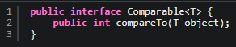

# Understanding Natural Ordering
### Bron : [code java](https://www.codejava.net/java-core/collections/understanding-object-ordering-in-java-with-comparable-and-comparator)

___

- compare value = 0: two objects are equal
- compare value > 0: the first object (the current object) is greater than the second one
- compare value < 0: the first object is less than the second one
___
 
Een klasse die de comparable interface implementeerd heeft ***class natural ordering***

String, Integer, Data en alle andere wrapperclasses implementern Comparable